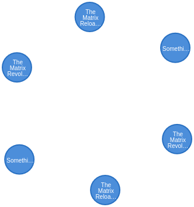
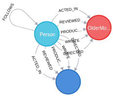
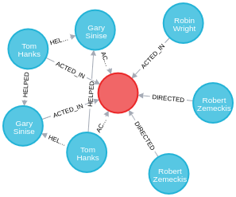
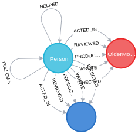
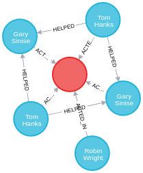
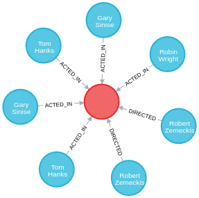

# Bancos de dados NoSQL: Atividade Prática – Neo4j

### Exercise 1: Retrieving Nodes 

```
    Added 171 labels, created 171 nodes, set 564 properties, created 253 relationships, completed after 56 ms.
```

### Exercise 1.1: Retrieve all nodes from the database 

```
    MATCH (n) RETURN n

    [
        {
            "n": {
            "identity": 0,
            "labels": [
                "Movie"
            ],
            "properties": {
                "title": "The Matrix",
                "tagline": "Welcome to the Real World",
                "released": 1999
            }
            }
        },
        {
            "n": {
            "identity": 1,
            "labels": [
                "Person"
            ],
            "properties": {
                "name": "Keanu Reeves",
                "born": 1964
            }
            }
        },
        {
            "n": {
            "identity": 2,
            "labels": [
                "Person"
            ],
            "properties": {
                "name": "Carrie-Anne Moss",
                "born": 1967
            }
            }
        }
    ]
```

### Exercise 1.2: Examine the schema of your database 

```
    CALL db.schema.visualization

    [
        {
            "nodes": [
            {
                "identity": -9,
                "labels": [
                "Movie"
                ],
                "properties": {
                "indexes": [],
                "name": "Movie",
                "constraints": []
                }
            },
            {
                "identity": -10,
                "labels": [
                "Person"
                ],
                "properties": {
                "indexes": [],
                "name": "Person",
                "constraints": []
                }
            }
            ]
        }
    ]
```

### Exercise 1.3: Retrieve all Person nodes (Instructions)

```
    MATCH (p:Person) RETURN p

    [
        {
            "p": {
            "identity": 1,
            "labels": [
                "Person"
            ],
            "properties": {
                "name": "Keanu Reeves",
                "born": 1964
            }
            }
        },
        {
            "p": {
            "identity": 2,
            "labels": [
                "Person"
            ],
            "properties": {
                "name": "Carrie-Anne Moss",
                "born": 1967
            }
            }
        },
        {
            "p": {
            "identity": 3,
            "labels": [
                "Person"
            ],
            "properties": {
                "name": "Laurence Fishburne",
                "born": 1961
            }
            }
        },
        {
            "p": {
            "identity": 4,
            "labels": [
                "Person"
            ],
            "properties": {
                "name": "Hugo Weaving",
                "born": 1960
            }
            }
        }
    ]
```

### Exercise 1.4: Retrieve all Movie nodes (Instructions)

```
    MATCH (m:Movie) RETURN m

    [
        {
            "m": {
            "identity": 0,
            "labels": [
                "Movie"
            ],
            "properties": {
                "title": "The Matrix",
                "tagline": "Welcome to the Real World",
                "released": 1999
            }
            }
        },
        {
            "m": {
            "identity": 9,
            "labels": [
                "Movie"
            ],
            "properties": {
                "title": "The Matrix Reloaded",
                "tagline": "Free your mind",
                "released": 2003
            }
            }
        },
        {
            "m": {
            "identity": 10,
            "labels": [
                "Movie"
            ],
            "properties": {
                "title": "The Matrix Revolutions",
                "tagline": "Everything that has a beginning has an end",
                "released": 2003
            }
            }
        },
        {
            "m": {
            "identity": 11,
            "labels": [
                "Movie"
            ],
            "properties": {
                "title": "The Devil's Advocate",
                "tagline": "Evil has its winning ways",
                "released": 1997
            }
            }
        }
    ]
```

### Exercise 2.1: Retrieve all movies that were released in a specific year (Instructions)

```
    MATCH (m:Movie {released:2003}) RETURN m

    
```


### Exercise 2.2: View the retrieved results as a table 

```
    [
        {
            "m": {
            "identity": 9,
            "labels": [
                "Movie"
            ],
            "properties": {
                "title": "The Matrix Reloaded",
                "tagline": "Free your mind",
                "released": 2003
            }
            }
        },
        {
            "m": {
            "identity": 10,
            "labels": [
                "Movie"
            ],
            "properties": {
                "title": "The Matrix Revolutions",
                "tagline": "Everything that has a beginning has an end",
                "released": 2003
            }
            }
        },
        {
            "m": {
            "identity": 154,
            "labels": [
                "Movie"
            ],
            "properties": {
                "title": "Something's Gotta Give",
                "released": 2003
            }
            }
        }
    ]
```

### Exercise 2.3: Query the database for all property keys 

```
    CALL db.propertyKeys

    [
        {
            "propertyKey": "tagline"
        },
        {
            "propertyKey": "title"
        },
        {
            "propertyKey": "released"
        },
        {
            "propertyKey": "born"
        },
        {
            "propertyKey": "name"
        },
        {
            "propertyKey": "roles"
        },
        {
            "propertyKey": "summary"
        },
        {
            "propertyKey": "rating"
        }
    ]
```

### Exercise 2.4: Retrieve all Movies released in a specific year, returning their titles 

```
    MATCH (m:Movie {released: 2006}) RETURN m.title

    [
        {
            "m.title": "RescueDawn"
        },
        {
            "m.title": "The Da Vinci Code"
        },
        {
            "m.title": "V for Vendetta"
        },
        {
            "m.title": "RescueDawn"
        },
        {
            "m.title": "The Da Vinci Code"
        },
        {
            "m.title": "V for Vendetta"
        }
    ]
```

### Exercise 2.5: Display title, released, and tagline values for every Movie node in the graph (Solution

```
    MATCH (m:Movie) RETURN m.title, m.released, m.tagline

    [
        {
            "m.title": "The Matrix",
            "m.released": 1999,
            "m.tagline": "Welcome to the Real World"
        },
        {
            "m.title": "The Matrix Reloaded",
            "m.released": 2003,
            "m.tagline": "Free your mind"
        },
        {
            "m.title": "The Matrix Revolutions",
            "m.released": 2003,
            "m.tagline": "Everything that has a beginning has an end"
        },
        {
            "m.title": "The Devil's Advocate",
            "m.released": 1997,
            "m.tagline": "Evil has its winning ways"
        }
    ]
```

### Exercise 2.6: Display more user-friendly headers in the table 

```
    MATCH (m:Movie) RETURN m.title AS `movie title`, m.released AS released, m.tagline AS tagLine

    [
        {
            "Movie Title": "The Matrix",
            "released": 1999,
            "tagline": "Welcome to the Real World"
        },
        {
            "Movie Title": "The Matrix Reloaded",
            "released": 2003,
            "tagline": "Free your mind"
        },
        {
            "Movie Title": "The Matrix Revolutions",
            "released": 2003,
            "tagline": "Everything that has a beginning has an end"
        },
        {
            "Movie Title": "The Devil's Advocate",
            "released": 1997,
            "tagline": "Evil has its winning ways"
        },
        {
            "Movie Title": "A Few Good Men",
            "released": 1992,
            "tagline": "In the heart of the nation's capital, in a courthouse of the U.S. government, one man will stop at nothing to keep his honor, and one will stop at nothing to find the truth."
        }
    ]    
```

### Exercise 3.1: Display the schema of the database (Instructions)

```
    CALL db.schema.visualization

    
```

### Exercise 3.2: Retrieve all people who wrote the movie Speed Racer 

```
    MATCH (p:Person)-[:WROTE]->(:Movie {title: 'Speed Racer'}) RETURN p.name

    [
        {
            "p.name": "Lana Wachowski"
        },
        {
            "p.name": "Lilly Wachowski"
        },
        {
            "p.name": "Lilly Wachowski"
        },
        {
            "p.name": "Lana Wachowski"
        }
    ]    
```

### Exercise 3.3: Retrieve all movies that are connected to the person, Tom Hanks 

```
    MATCH (m:Movie)<--(:Person {name: 'Tom Hanks'}) RETURN m.title

    [
        {
            "m.title": "A League of Their Own"
        },
        {
            "m.title": "Cloud Atlas"
        },
        {
            "m.title": "The Da Vinci Code"
        },
        {
            "m.title": "Sleepless in Seattle"
        },
        {
            "m.title": "The Polar Express"
        },
        {
            "m.title": "The Green Mile"
        },
        {
            "m.title": "Cast Away"
        },
        {
            "m.title": "Charlie Wilson's War"
        },
        {
            "m.title": "That Thing You Do"
        },
        {
            "m.title": "That Thing You Do"
        },
        {
            "m.title": "Joe Versus the Volcano"
        },
        {
            "m.title": "Apollo 13"
        },
        {
            "m.title": "You've Got Mail"
        },
        {
            "m.title": "Cast Away"
        },
        {
            "m.title": "Joe Versus the Volcano"
        },
        {
            "m.title": "Cloud Atlas"
        },
        {
            "m.title": "That Thing You Do"
        },
        {
            "m.title": "The Green Mile"
        },
        {
            "m.title": "Apollo 13"
        },
        {
            "m.title": "Sleepless in Seattle"
        },
        {
            "m.title": "Charlie Wilson's War"
        },
        {
            "m.title": "A League of Their Own"
        },
        {
            "m.title": "That Thing You Do"
        },
        {
            "m.title": "The Da Vinci Code"
        },
        {
            "m.title": "You've Got Mail"
        },
        {
            "m.title": "The Polar Express"
        }
    ]
```

### Exercise 3.4: Retrieve information about the relationships Tom Hanks has with the set of movies retrieved earlier 

```
    MATCH (m:Movie)-[rel]-(:Person {name: 'Tom Hanks'}) RETURN m.title, type(rel)

    [
        {
            "m.title": "A League of Their Own",
            "type(rel)": "ACTED_IN"
        },
        {
            "m.title": "Cloud Atlas",
            "type(rel)": "ACTED_IN"
        },
        {
            "m.title": "The Da Vinci Code",
            "type(rel)": "ACTED_IN"
        },
        {
            "m.title": "Sleepless in Seattle",
            "type(rel)": "ACTED_IN"
        },
        {
            "m.title": "The Polar Express",
            "type(rel)": "ACTED_IN"
        },
        {
            "m.title": "The Green Mile",
            "type(rel)": "ACTED_IN"
        },
        {
            "m.title": "Cast Away",
            "type(rel)": "ACTED_IN"
        },
        {
            "m.title": "Charlie Wilson's War",
            "type(rel)": "ACTED_IN"
        },
        {
            "m.title": "That Thing You Do",
            "type(rel)": "ACTED_IN"
        },
        {
            "m.title": "That Thing You Do",
            "type(rel)": "DIRECTED"
        },
        {
            "m.title": "Joe Versus the Volcano",
            "type(rel)": "ACTED_IN"
        },
        {
            "m.title": "Apollo 13",
            "type(rel)": "ACTED_IN"
        },
        {
            "m.title": "You've Got Mail",
            "type(rel)": "ACTED_IN"
        },
        {
            "m.title": "Cast Away",
            "type(rel)": "ACTED_IN"
        }   
    ]
```

### Exercise 3.5: Retrieve information about the roles that Tom Hanks acted in 

```
    MATCH (m:Movie)-[rel:ACTED_IN]-(:Person {name: 'Tom Hanks'}) RETURN m.title, rel.roles

    [
        {
            "m.title": "A League of Their Own",
            "rel.roles": [
            "Jimmy Dugan"
            ]
        },
        {
            "m.title": "Cloud Atlas",
            "rel.roles": [
            "Zachry",
            "Dr. Henry Goose",
            "Isaac Sachs",
            "Dermot Hoggins"
            ]
        },
        {
            "m.title": "The Da Vinci Code",
            "rel.roles": [
            "Dr. Robert Langdon"
            ]
        },
        {
            "m.title": "Sleepless in Seattle",
            "rel.roles": [
            "Sam Baldwin"
            ]
        }
    ]
```

### Exercise 4.1: Retrieve all movies that Tom Cruise acted in 

```
    MATCH (a:Person)-[:ACTED_IN]->(m:Movie)
    WHERE a.name = 'Tom Cruise'
    RETURN m.title as Movie

    [
        {
            "Movie": "Jerry Maguire"
        },
        {
            "Movie": "Top Gun"
        },
        {
            "Movie": "A Few Good Men"
        },
        {
            "Movie": "Top Gun"
        },
        {
            "Movie": "Jerry Maguire"
        },
        {
            "Movie": "A Few Good Men"
        }
    ]
```

### Exercise 4.2: Retrieve all people that were born in the 70’s 

```
    MATCH (a:Person)
    WHERE a.born >= 1970 AND a.born < 1980
    RETURN a.name as Name, a.born as `Year Born`

    [
        {
            "Name": "Emil Eifrem",
            "Years Born": 1978
        },
        {
            "Name": "Charlize Theron",
            "Years Born": 1975
        },
        {
            "Name": "Noah Wyle",
            "Years Born": 1971
        },
        {
            "Name": "Jerry O'Connell",
            "Years Born": 1974
        },
        {
            "Name": "Jay Mohr",
            "Years Born": 1970
        },
        {
            "Name": "Regina King",
            "Years Born": 1971
        },
        {
            "Name": "River Phoenix",
            "Years Born": 1970
        },
        {
            "Name": "Corey Feldman",
            "Years Born": 1971
        }
    ]
```

### Exercise 4.3: Retrieve the actors who acted in the movie The Matrix who were born after 1960 

```
    MATCH (a:Person)-[:ACTED_IN]->(m:Movie)
    WHERE a.born > 1960 AND m.title = 'The Matrix'
    RETURN a.name as Name, a.born as `Year Born`

    [
        {
            "Name": "Emil Eifrem",
            "Years Born": 1978
        },
        {
            "Name": "Laurence Fishburne",
            "Years Born": 1961
        },
        {
            "Name": "Carrie-Anne Moss",
            "Years Born": 1967
        },
        {
            "Name": "Keanu Reeves",
            "Years Born": 1964
        },
        {
            "Name": "Keanu Reeves",
            "Years Born": 1964
        },
        {
            "Name": "Emil Eifrem",
            "Years Born": 1978
        },
        {
            "Name": "Laurence Fishburne",
            "Years Born": 1961
        },
        {
            "Name": "Carrie-Anne Moss",
            "Years Born": 1967
        }
    ]
```

### Exercise 4.4: Retrieve all movies by testing the node label and a property 

```
    MATCH (m)
    WHERE m:Movie AND m.released = 2000
    RETURN m.title

    [
        {
            "m.title": "Jerry Maguire"
        },
        {
            "m.title": "The Replacements"
        },
        {
            "m.title": "Cast Away"
        },
        {
            "m.title": "Jerry Maguire"
        },
        {
            "m.title": "The Replacements"
        },
        {
            "m.title": "Cast Away"
        }
    ]
```

### Exercise 4.5: Retrieve all people that wrote movies by testing the relationship between two nodes 

```
    MATCH (a)-[rel]->(m)
    WHERE a:Person AND type(rel) = 'WROTE' AND m:Movie
    RETURN a.name as Name, m.title as Movie

    [
        {
            "Name": "Aaron Sorkin",
            "Movie": "A Few Good Men"
        },
        {
            "Name": "Jim Cash",
            "Movie": "Top Gun"
        },
        {
            "Name": "Cameron Crowe",
            "Movie": "Jerry Maguire"
        },
        {
            "Name": "Nora Ephron",
            "Movie": "When Harry Met Sally"
        },
        {
            "Name": "David Mitchell",
            "Movie": "Cloud Atlas"
        },
        {
            "Name": "Lana Wachowski",
            "Movie": "V for Vendetta"
        },
        {
            "Name": "Lilly Wachowski",
            "Movie": "V for Vendetta"
        },
        {
            "Name": "Lana Wachowski",
            "Movie": "Speed Racer"
        }
    ]
```

### Exercise 4.6: Retrieve all people in the graph that do not have a property 

```
    MATCH (a:Person)
    WHERE NOT exists(a.born)
    RETURN a.name as Name

    [
        {
            "Name": "Naomie Harris"
        },
        {
            "Name": "Paul Blythe"
        },
        {
            "Name": "Angela Scope"
        },
        {
            "Name": "Jessica Thompson"
        },
        {
            "Name": "James Thompson"
        },
        {
            "Name": "Naomie Harris"
        },
        {
            "Name": "Paul Blythe"
        },
        {
            "Name": "Angela Scope"
        },
        {
            "Name": "Jessica Thompson"
        },
        {
            "Name": "James Thompson"
        }
    ]
```

### Exercise 4.7: Retrieve all people related to movies where the relationship has a property 

```
    MATCH (a:Person)-[rel]->(m:Movie)
    WHERE exists(rel.rating)
    RETURN a.name as Name, m.title as Movie, rel.rating as Rating

    [
        {
            "Name": "Jessica Thompson",
            "Movie": "Jerry Maguire",
            "Rating": 92
        },
        {
            "Name": "Angela Scope",
            "Movie": "The Replacements",
            "Rating": 62
        },
        {
            "Name": "James Thompson",
            "Movie": "The Replacements",
            "Rating": 100
        },
        {
            "Name": "Jessica Thompson",
            "Movie": "The Replacements",
            "Rating": 65
        },
        {
            "Name": "Jessica Thompson",
            "Movie": "The Birdcage",
            "Rating": 45
        },
        {
            "Name": "Jessica Thompson",
            "Movie": "Unforgiven",
            "Rating": 85
        },
        {
            "Name": "Jessica Thompson",
            "Movie": "Cloud Atlas",
            "Rating": 95
        },
        {
            "Name": "James Thompson",
            "Movie": "The Da Vinci Code",
            "Rating": 65
        },
        {
            "Name": "Jessica Thompson",
            "Movie": "The Da Vinci Code",
            "Rating": 68
        }
    ]
```

### Exercise 4.8: Retrieve all actors whose name begins with James 

```
    MATCH (a:Person)-[:ACTED_IN]->(:Movie)
    WHERE a.name STARTS WITH 'James'
    RETURN a.name

    [
        {
            "Name": "James Marshall"
        },
        {
            "Name": "James Cromwell"
        },
        {
            "Name": "James Cromwell"
        },
        {
            "Name": "James Marshall"
        },
        {
            "Name": "James Cromwell"
        },
        {
            "Name": "James Cromwell"
        }
    ]
```

### Exercise 4.9: Retrieve all REVIEWED relationships from the graph with filtered results 

```
    MATCH (:Person)-[r:REVIEWED]->(m:Movie)
    WHERE toLower(r.summary) CONTAINS 'fun'
    RETURN  m.title as Movie, r.summary as Review, r.rating as Rating

    [
        {
            "Movie": "The Replacements",
            "Review": "Pretty funny at times",
            "Rating": 62
        },
        {
            "Movie": "The Replacements",
            "Review": "Silly, but fun",
            "Rating": 65
        },
        {
            "Movie": "The Da Vinci Code",
            "Review": "Fun, but a little far fetched",
            "Rating": 65
        },
        {
            "Movie": "The Replacements",
            "Review": "Pretty funny at times",
            "Rating": 62
        },
        {
            "Movie": "The Replacements",
            "Review": "Silly, but fun",
            "Rating": 65
        },
        {
            "Movie": "The Da Vinci Code",
            "Review": "Fun, but a little far fetched",
            "Rating": 65
        }
    ]
```

### Exercise 4.10: Retrieve all people who have produced a movie, but have not directed a movie 

```
    MATCH (a:Person)-[:PRODUCED]->(m:Movie)
    WHERE NOT ((a)-[:DIRECTED]->(:Movie))
    RETURN a.name, m.title

    [
        {
            "Name": "Joel Silver",
            "Movie": "The Matrix"
        },
        {
            "Name": "Joel Silver",
            "Movie": "The Matrix Reloaded"
        },
        {
            "Name": "Joel Silver",
            "Movie": "The Matrix Revolutions"
        },
        {
            "Name": "Nora Ephron",
            "Movie": "When Harry Met Sally"
        },
        {
            "Name": "Stefan Arndt",
            "Movie": "Cloud Atlas"
        },
        {
            "Name": "Lilly Wachowski",
            "Movie": "V for Vendetta"
        },
        {
            "Name": "Lana Wachowski",
            "Movie": "V for Vendetta"
        },
        {
            "Name": "Joel Silver",
            "Movie": "V for Vendetta"
        }
    ]
```

### Exercise 4.11: Retrieve the movies and their actors where one of the actors also directed the movie 

```
    MATCH (a1:Person)-[:ACTED_IN]->(m:Movie)<-[:ACTED_IN]-(a2:Person)
    WHERE exists( (a2)-[:DIRECTED]->(m) )
    RETURN  a1.name as Actor, a2.name as `Actor/Director`, m.title as Movie

    [
        {
            "Actor": "Liv Tyler",
            "Actor/Director": "Tom Hanks",
            "Movie": "That Thing You Do"
        },
        {
            "Actor": "Charlize Theron",
            "Actor/Director": "Tom Hanks",
            "Movie": "That Thing You Do"
        },
        {
            "Actor": "Gene Hackman",
            "Actor/Director": "Clint Eastwood",
            "Movie": "Unforgiven"
        },
        {
            "Actor": "Richard Harris",
            "Actor/Director": "Clint Eastwood",
            "Movie": "Unforgiven"
        },
        {
            "Actor": "Jack Nicholson",
            "Actor/Director": "Danny DeVito",
            "Movie": "Hoffa"
        },
        {
            "Actor": "J.T. Walsh",
            "Actor/Director": "Danny DeVito",
            "Movie": "Hoffa"
        },
        {
            "Actor": "John C. Reilly",
            "Actor/Director": "Danny DeVito",
            "Movie": "Hoffa"
        },
        {
            "Actor": "Liv Tyler",
            "Actor/Director": "Tom Hanks",
            "Movie": "That Thing You Do"
        },
        {
            "Actor": "Charlize Theron",
            "Actor/Director": "Tom Hanks",
            "Movie": "That Thing You Do"
        },
        {
            "Actor": "Gene Hackman",
            "Actor/Director": "Clint Eastwood",
            "Movie": "Unforgiven"
        },
        {
            "Actor": "Richard Harris",
            "Actor/Director": "Clint Eastwood",
            "Movie": "Unforgiven"
        },
        {
            "Actor": "John C. Reilly",
            "Actor/Director": "Danny DeVito",
            "Movie": "Hoffa"
        },
        {
            "Actor": "J.T. Walsh",
            "Actor/Director": "Danny DeVito",
            "Movie": "Hoffa"
        },
        {
            "Actor": "Jack Nicholson",
            "Actor/Director": "Danny DeVito",
            "Movie": "Hoffa"
        }
    ]
```

### Exercise 4.12: Retrieve all movies that were released in a set of years 

```
    MATCH (m:Movie)
    WHERE m.released in [2000, 2004, 2008]
    RETURN m.title, m.released

    [
        {
            "m.title": "Jerry Maguire",
            "m.released": 2000
        },
        {
            "m.title": "The Replacements",
            "m.released": 2000
        },
        {
            "m.title": "Speed Racer",
            "m.released": 2008
        },
        {
            "m.title": "Frost/Nixon",
            "m.released": 2008
        },
        {
            "m.title": "Cast Away",
            "m.released": 2000
        },
        {
            "m.title": "The Polar Express",
            "m.released": 2004
        },
        {
            "m.title": "Jerry Maguire",
            "m.released": 2000
        },
        {
            "m.title": "The Replacements",
            "m.released": 2000
        },
        {
            "m.title": "Speed Racer",
            "m.released": 2008
        },
        {
            "m.title": "Frost/Nixon",
            "m.released": 2008
        },
        {
            "m.title": "Cast Away",
            "m.released": 2000
        },
        {
            "m.title": "The Polar Express",
            "m.released": 2004
        }
    ]
```

### Exercise 4.13: Retrieve the movies that have an actor’s role that is the name of the movie 

```
    MATCH (a:Person)-[r:ACTED_IN]->(m:Movie)
    WHERE m.title in r.roles
    RETURN  m.title as Movie, a.name as Actor

    [
        {
            "Movie": "Jerry Maguire",
            "Actor": "Tom Cruise"
        },
        {
            "Movie": "Johnny Mnemonic",
            "Actor": "Keanu Reeves"
        },
        {
            "Movie": "Speed Racer",
            "Actor": "Emile Hirsch"
        },
        {
            "Movie": "Hoffa",
            "Actor": "Jack Nicholson"
        },
        {
            "Movie": "Jerry Maguire",
            "Actor": "Tom Cruise"
        },
        {
            "Movie": "Johnny Mnemonic",
            "Actor": "Keanu Reeves"
        },
        {
            "Movie": "Speed Racer",
            "Actor": "Emile Hirsch"
        },
        {
            "Movie": "Hoffa",
            "Actor": "Jack Nicholson"
        }
    ]
```

### Exercise 5.1: Retrieve data using multiple MATCH patterns 

```
    MATCH (a:Person)-[:ACTED_IN]->(m:Movie)<-[:DIRECTED]-(d:Person),
      (a2:Person)-[:ACTED_IN]->(m)
    WHERE a.name = 'Gene Hackman'
    RETURN m.title as movie, d.name AS director , a2.name AS `co-actors`

    [
        {
            "movie": "The Birdcage",
            "director": "Mike Nichols",
            "co-actors": "Robin Williams"
        },
        {
            "movie": "The Birdcage",
            "director": "Mike Nichols",
            "co-actors": "Nathan Lane"
        },
        {
            "movie": "The Replacements",
            "director": "Howard Deutch",
            "co-actors": "Keanu Reeves"
        },
        {
            "movie": "The Replacements",
            "director": "Howard Deutch",
            "co-actors": "Orlando Jones"
        },
        {
            "movie": "The Replacements",
            "director": "Howard Deutch",
            "co-actors": "Brooke Langton"
        },
        {
            "movie": "Unforgiven",
            "director": "Clint Eastwood",
            "co-actors": "Richard Harris"
        },
        {
            "movie": "Unforgiven",
            "director": "Clint Eastwood",
            "co-actors": "Clint Eastwood"
        },
        {
            "movie": "Unforgiven",
            "director": "Clint Eastwood",
            "co-actors": "Clint Eastwood"
        },
        {
            "movie": "Unforgiven",
            "director": "Clint Eastwood",
            "co-actors": "Richard Harris"
        },
        {
            "movie": "The Replacements",
            "director": "Howard Deutch",
            "co-actors": "Orlando Jones"
        },
        {
            "movie": "The Replacements",
            "director": "Howard Deutch",
            "co-actors": "Keanu Reeves"
        },
        {
            "movie": "The Replacements",
            "director": "Howard Deutch",
            "co-actors": "Brooke Langton"
        },
        {
            "movie": "The Birdcage",
            "director": "Mike Nichols",
            "co-actors": "Robin Williams"
        },
        {
            "movie": "The Birdcage",
            "director": "Mike Nichols",
            "co-actors": "Nathan Lane"
        }
    ]
```

### Exercise 5.2: Retrieve particular nodes that have a relationship 

```
    MATCH (p1:Person)-[:FOLLOWS]-(p2:Person)
    WHERE p1.name = 'James Thompson'
    RETURN p1, p2

    [
        {
            "p1": {
            "identity": 170,
            "labels": [
                "Person"
            ],
            "properties": {
                "name": "James Thompson"
            }
            },
            "p2": {
            "identity": 169,
            "labels": [
                "Person"
            ],
            "properties": {
                "name": "Jessica Thompson"
            }
            }
        },
        {
            "p1": {
            "identity": 341,
            "labels": [
                "Person"
            ],
            "properties": {
                "name": "James Thompson"
            }
            },
            "p2": {
            "identity": 340,
            "labels": [
                "Person"
            ],
            "properties": {
                "name": "Jessica Thompson"
            }
            }
        }
    ]
```

### Exercise 5.3: Modify the query to retrieve nodes that are exactly three hops away 

```
    MATCH (p1:Person)-[:FOLLOWS*3]-(p2:Person)
    WHERE p1.name = 'James Thompson'
    RETURN p1, p2

    [
        {
            "p1": {
            "identity": 170,
            "labels": [
                "Person"
            ],
            "properties": {
                "name": "James Thompson"
            }
            },
            "p2": {
            "identity": 167,
            "labels": [
                "Person"
            ],
            "properties": {
                "name": "Paul Blythe"
            }
            }
        },
        {
            "p1": {
            "identity": 341,
            "labels": [
                "Person"
            ],
            "properties": {
                "name": "James Thompson"
            }
            },
            "p2": {
            "identity": 338,
            "labels": [
                "Person"
            ],
            "properties": {
                "name": "Paul Blythe"
            }
            }
        }
    ]
```

### Exercise 5.4: Modify the query to retrieve nodes that are one and two hops away 

```
    MATCH (p1:Person)-[:FOLLOWS*1..2]-(p2:Person)
    WHERE p1.name = 'James Thompson'
    RETURN p1, p2

    [
        {
            "p1": {
            "identity": 170,
            "labels": [
                "Person"
            ],
            "properties": {
                "name": "James Thompson"
            }
            },
            "p2": {
            "identity": 169,
            "labels": [
                "Person"
            ],
            "properties": {
                "name": "Jessica Thompson"
            }
            }
        },
        {
            "p1": {
            "identity": 170,
            "labels": [
                "Person"
            ],
            "properties": {
                "name": "James Thompson"
            }
            },
            "p2": {
            "identity": 168,
            "labels": [
                "Person"
            ],
            "properties": {
                "name": "Angela Scope"
            }
            }
        },
        {
            "p1": {
            "identity": 341,
            "labels": [
                "Person"
            ],
            "properties": {
                "name": "James Thompson"
            }
            },
            "p2": {
            "identity": 340,
            "labels": [
                "Person"
            ],
            "properties": {
                "name": "Jessica Thompson"
            }
            }
        },
        {
            "p1": {
            "identity": 341,
            "labels": [
                "Person"
            ],
            "properties": {
                "name": "James Thompson"
            }
            },
            "p2": {
            "identity": 339,
            "labels": [
                "Person"
            ],
            "properties": {
                "name": "Angela Scope"
            }
            }
        }
    ]
```

### Exercise 5.5: Modify the query to retrieve particular nodes that are connected no matter how many hops are required 

```
    MATCH (p1:Person)-[:FOLLOWS*]-(p2:Person)
    WHERE p1.name = 'James Thompson'
    RETURN p1, p2

    [
        {
            "p1": {
            "identity": 170,
            "labels": [
                "Person"
            ],
            "properties": {
                "name": "James Thompson"
            }
            },
            "p2": {
            "identity": 169,
            "labels": [
                "Person"
            ],
            "properties": {
                "name": "Jessica Thompson"
            }
            }
        },
        {
            "p1": {
            "identity": 170,
            "labels": [
                "Person"
            ],
            "properties": {
                "name": "James Thompson"
            }
            },
            "p2": {
            "identity": 168,
            "labels": [
                "Person"
            ],
            "properties": {
                "name": "Angela Scope"
            }
            }
        }
    ]
```

### Exercise 5.6: Specify optional data to be retrieved during the query 

```
    MATCH (p:Person)
    WHERE p.name STARTS WITH 'Tom'
    OPTIONAL MATCH (p)-[:DIRECTED]->(m:Movie)
    RETURN p.name, m.title

    [
        {
            "Name": "Tom Cruise",
            "Movie": null
        },
        {
            "Name": "Tom Skerritt",
            "Movie": null
        },
        {
            "Name": "Tom Hanks",
            "Movie": "That Thing You Do"
        },
        {
            "Name": "Tom Tykwer",
            "Movie": "Cloud Atlas"
        },
        {
            "Name": "Tom Cruise",
            "Movie": null
        },
        {
            "Name": "Tom Skerritt",
            "Movie": null
        },
        {
            "Name": "Tom Hanks",
            "Movie": "That Thing You Do"
        },
        {
            "Name": "Tom Tykwer",
            "Movie": "Cloud Atlas"
        }
    ]
```

### Exercise 5.7: Retrieve nodes by collecting a list 

```
    MATCH (p:Person)-[:ACTED_IN]->(m:Movie)
    RETURN p.name as actor, collect(m.title) AS `movie list`

    [
        {
            "actor": "Emil Eifrem",
            "movie list": [
            "The Matrix",
            "The Matrix"
            ]
        },
        {
            "actor": "Laurence Fishburne",
            "movie list": [
            "The Matrix",
            "The Matrix Reloaded",
            "The Matrix Revolutions",
            "The Matrix",
            "The Matrix Reloaded",
            "The Matrix Revolutions"
            ]
        },
        {
            "actor": "Hugo Weaving",
            "movie list": [
            "The Matrix",
            "The Matrix Reloaded",
            "The Matrix Revolutions",
            "Cloud Atlas",
            "V for Vendetta",
            "The Matrix",
            "The Matrix Reloaded",
            "The Matrix Revolutions",
            "Cloud Atlas",
            "V for Vendetta"
            ]
        },
        {
            "actor": "Carrie-Anne Moss",
            "movie list": [
            "The Matrix",
            "The Matrix Reloaded",
            "The Matrix Revolutions",
            "The Matrix",
            "The Matrix Reloaded",
            "The Matrix Revolutions"
            ]
        }
    ]
```

### Exercise 5.8: Retrieve all movies that Tom Cruise has acted in and the co-actors that acted in the same movie by collecting a list 

```
    MATCH (p:Person)-[:ACTED_IN]->(m:Movie)<-[:ACTED_IN]-(p2:Person)
    WHERE p.name ='Tom Cruise'
    RETURN m.title as movie, collect(p2.name) AS `co-actors`

    [
        {
            "movie": "Jerry Maguire",
            "co-actors": [
            "Regina King",
            "Bonnie Hunt",
            "Jonathan Lipnicki",
            "Jerry O'Connell",
            "Cuba Gooding Jr.",
            "Jay Mohr",
            "Kelly Preston",
            "Renee Zellweger",
            "Renee Zellweger",
            "Kelly Preston",
            "Cuba Gooding Jr.",
            "Jonathan Lipnicki",
            "Bonnie Hunt",
            "Regina King",
            "Jay Mohr",
            "Jerry O'Connell"
            ]
        },
        {
            "movie": "Top Gun",
            "co-actors": [
            "Kelly McGillis",
            "Anthony Edwards",
            "Meg Ryan",
            "Tom Skerritt",
            "Val Kilmer",
            "Anthony Edwards",
            "Meg Ryan",
            "Tom Skerritt",
            "Val Kilmer",
            "Kelly McGillis"
            ]
        },
        {
            "movie": "A Few Good Men",
            "co-actors": [
            "Aaron Sorkin",
            "Jack Nicholson",
            "Kevin Pollak",
            "Cuba Gooding Jr.",
            "Demi Moore",
            "James Marshall",
            "Kevin Bacon",
            "Kiefer Sutherland",
            "Christopher Guest",
            "J.T. Walsh",
            "Noah Wyle",
            "Kevin Bacon",
            "Demi Moore",
            "Aaron Sorkin",
            "J.T. Walsh",
            "Kiefer Sutherland",
            "Kevin Pollak",
            "Noah Wyle",
            "Cuba Gooding Jr.",
            "Christopher Guest",
            "Jack Nicholson",
            "James Marshall"
            ]
        }
    ]
```

### Exercise 5.9: Retrieve nodes as lists and return data associated with the corresponding lists 

```
    MATCH (p:Person)-[:REVIEWED]->(m:Movie)
    RETURN m.title as movie, count(p) as numReviews, collect(p.name) as reviewers

    [
        {
            "movie": "Jerry Maguire",
            "numReviews": 2,
            "reviewers": [
            "Jessica Thompson",
            "Jessica Thompson"
            ]
        },
        {
            "movie": "The Replacements",
            "numReviews": 6,
            "reviewers": [
            "Angela Scope",
            "James Thompson",
            "Jessica Thompson",
            "Angela Scope",
            "James Thompson",
            "Jessica Thompson"
            ]
        },
        {
            "movie": "The Birdcage",
            "numReviews": 2,
            "reviewers": [
            "Jessica Thompson",
            "Jessica Thompson"
            ]
        },
        {
            "movie": "Unforgiven",
            "numReviews": 2,
            "reviewers": [
            "Jessica Thompson",
            "Jessica Thompson"
            ]
        },
        {
            "movie": "Cloud Atlas",
            "numReviews": 2,
            "reviewers": [
            "Jessica Thompson",
            "Jessica Thompson"
            ]
        },
        {
            "movie": "The Da Vinci Code",
            "numReviews": 4,
            "reviewers": [
            "James Thompson",
            "Jessica Thompson",
            "Jessica Thompson",
            "James Thompson"
            ]
        }
    ]
```

### Exercise 5.10: Retrieve nodes and their relationships as list 

```
    MATCH (d:Person)-[:DIRECTED]->(m:Movie)<-[:ACTED_IN]-(a:Person)
    RETURN d.name AS director, count(a) AS `number actors` , collect(a.name) AS `actors worked with`

    [
        {
            "director": "Lana Wachowski",
            "number actors": 48,
            "actors worked with": [
            "Emil Eifrem",
            "Laurence Fishburne",
            "Hugo Weaving",
            "Carrie-Anne Moss",
            "Keanu Reeves",
            "Keanu Reeves",
            "Hugo Weaving",
            "Laurence Fishburne",
            "Carrie-Anne Moss",
            "Keanu Reeves",
            "Hugo Weaving",
            "Carrie-Anne Moss",
            "Laurence Fishburne",
            "Hugo Weaving",
            "Tom Hanks",
            "Jim Broadbent",
            "Halle Berry",
            "Rain",
            "Susan Sarandon",
            "Christina Ricci",
            "Matthew Fox",
            "Emile Hirsch",
            "Ben Miles",
            "John Goodman",
            "Hugo Weaving",
            "Keanu Reeves",
            "Emil Eifrem",
            "Laurence Fishburne",
            "Carrie-Anne Moss",
            "Laurence Fishburne",
            "Hugo Weaving",
            "Keanu Reeves",
            "Carrie-Anne Moss",
            "Laurence Fishburne",
            "Carrie-Anne Moss",
            "Keanu Reeves",
            "Hugo Weaving",
            "Tom Hanks",
            "Jim Broadbent",
            "Hugo Weaving",
            "Halle Berry",
            "Susan Sarandon",
            "Emile Hirsch",
            "Rain",
            "Ben Miles",
            "Christina Ricci",
            "Matthew Fox",
            "John Goodman"
            ]
        }
    ]
```

### Exercise 5.11: Retrieve the actors who have acted in exactly five movies 

```
    MATCH (a:Person)-[:ACTED_IN]->(m:Movie)
    WITH  a, count(a) AS numMovies, collect(m.title) AS movies
    WHERE numMovies = 5
    RETURN a.name, movies

    [
        {
            "a.name": "Hugo Weaving",
            "movies": [
            "The Matrix",
            "The Matrix Reloaded",
            "The Matrix Revolutions",
            "Cloud Atlas",
            "V for Vendetta"
            ]
        },
        {
            "a.name": "Jack Nicholson",
            "movies": [
            "A Few Good Men",
            "As Good as It Gets",
            "Hoffa",
            "One Flew Over the Cuckoo's Nest",
            "Something's Gotta Give"
            ]
        },
        {
            "a.name": "Meg Ryan",
            "movies": [
            "Top Gun",
            "You've Got Mail",
            "Sleepless in Seattle",
            "Joe Versus the Volcano",
            "When Harry Met Sally"
            ]
        },
        {
            "a.name": "Hugo Weaving",
            "movies": [
            "The Matrix",
            "The Matrix Reloaded",
            "The Matrix Revolutions",
            "Cloud Atlas",
            "V for Vendetta"
            ]
        },
        {
            "a.name": "Jack Nicholson",
            "movies": [
            "A Few Good Men",
            "As Good as It Gets",
            "Hoffa",
            "One Flew Over the Cuckoo's Nest",
            "Something's Gotta Give"
            ]
        },
        {
            "a.name": "Meg Ryan",
            "movies": [
            "Top Gun",
            "You've Got Mail",
            "Sleepless in Seattle",
            "Joe Versus the Volcano",
            "When Harry Met Sally"
            ]
        }
    ]
```

### Exercise 5.12: Retrieve the movies that have at least 2 directors with other optional data 

```
    MATCH (m:Movie)
    WITH m, size((:Person)-[:DIRECTED]->(m)) AS directors
    WHERE directors >= 2
    OPTIONAL MATCH (p:Person)-[:REVIEWED]->(m)
    RETURN  m.title, p.name

    [
        {
            "Movie": "The Matrix",
            "Name": null
        },
        {
            "Movie": "The Matrix Reloaded",
            "Name": null
        },
        {
            "Movie": "The Matrix Revolutions",
            "Name": null
        },
        {
            "Movie": "Cloud Atlas",
            "Name": "Jessica Thompson"
        },
        {
            "Movie": "Speed Racer",
            "Name": null
        },
        {
            "Movie": "The Matrix",
            "Name": null
        },
        {
            "Movie": "The Matrix Reloaded",
            "Name": null
        },
        {
            "Movie": "The Matrix Revolutions",
            "Name": null
        },
        {
            "Movie": "Cloud Atlas",
            "Name": "Jessica Thompson"
        },
        {
            "Movie": "Speed Racer",
            "Name": null
        }
    ]
```

### Exercise 6.1: Execute a query that returns duplicate records. 

```
    MATCH (a:Person)-[:ACTED_IN]->(m:Movie)
    WHERE m.released >= 1990 AND m.released < 2000
    RETURN DISTINCT m.released, m.title, collect(a.name)

    [
        {
            "m.released": 1999,
            "m.title": "The Matrix",
            "collect(a.name)": [
            "Emil Eifrem",
            "Laurence Fishburne",
            "Hugo Weaving",
            "Carrie-Anne Moss",
            "Keanu Reeves",
            "Hugo Weaving",
            "Keanu Reeves",
            "Emil Eifrem",
            "Laurence Fishburne",
            "Carrie-Anne Moss"
            ]
        },
        {
            "m.released": 1997,
            "m.title": "The Devil's Advocate",
            "collect(a.name)": [
            "Charlize Theron",
            "Keanu Reeves",
            "Al Pacino",
            "Charlize Theron",
            "Keanu Reeves",
            "Al Pacino"
            ]
        },
        {
            "m.released": 1992,
            "m.title": "A Few Good Men",
            "collect(a.name)": [
            "Aaron Sorkin",
            "Jack Nicholson",
            "Kevin Pollak",
            "Cuba Gooding Jr.",
            "Demi Moore",
            "Tom Cruise",
            "James Marshall",
            "Kevin Bacon",
            "Kiefer Sutherland",
            "Christopher Guest",
            "J.T. Walsh",
            "Noah Wyle",
            "Kevin Bacon",
            "Demi Moore",
            "Aaron Sorkin",
            "J.T. Walsh",
            "Kiefer Sutherland",
            "Kevin Pollak",
            "Noah Wyle",
            "Cuba Gooding Jr.",
            "Christopher Guest",
            "Tom Cruise",
            "Jack Nicholson",
            "James Marshall"
            ]
        }
    ]
```

### Exercise 6.2: Modify the query to eliminate duplication 

```
    MATCH (a:Person)-[:ACTED_IN]->(m:Movie)
    WHERE m.released >= 1990 AND m.released < 2000
    RETURN  m.released, collect(m.title), collect(a.name)

    [
        {
            "m.released": 1999,
            "collect(m.title)": [
            "The Matrix",
            "The Matrix",
            "The Matrix",
            "The Matrix",
            "The Matrix",
            "Snow Falling on Cedars",
            "Snow Falling on Cedars",
            "Snow Falling on Cedars",
            "Snow Falling on Cedars",
            "The Green Mile",
            "The Green Mile",
            "The Green Mile",
            "The Green Mile",
            "The Green Mile",
            "The Green Mile",
            "The Green Mile",
            "The Green Mile",
            "Bicentennial Man",
            "Bicentennial Man",
            "The Matrix",
            "The Matrix",
            "The Matrix",
            "The Matrix",
            "The Matrix",
            "Snow Falling on Cedars",
            "Snow Falling on Cedars",
            "Snow Falling on Cedars",
            "Snow Falling on Cedars",
            "The Green Mile",
            "The Green Mile",
            "The Green Mile",
            "The Green Mile",
            "The Green Mile",
            "The Green Mile",
            "The Green Mile",
            "The Green Mile",
            "Bicentennial Man",
            "Bicentennial Man"
            ],
            "collect(a.name)": [
            "Emil Eifrem",
            "Laurence Fishburne",
            "Hugo Weaving",
            "Carrie-Anne Moss",
            "Keanu Reeves",
            "Rick Yune",
            "James Cromwell",
            "Ethan Hawke",
            "Max von Sydow",
            "Tom Hanks",
            "Bonnie Hunt",
            "James Cromwell",
            "Patricia Clarkson",
            "Gary Sinise",
            "David Morse",
            "Michael Clarke Duncan",
            "Sam Rockwell",
            "Oliver Platt",
            "Robin Williams",
            "Hugo Weaving",
            "Keanu Reeves",
            "Emil Eifrem",
            "Laurence Fishburne",
            "Carrie-Anne Moss",
            "Rick Yune",
            "Ethan Hawke",
            "James Cromwell",
            "Max von Sydow",
            "David Morse",
            "Sam Rockwell",
            "Patricia Clarkson",
            "Bonnie Hunt",
            "Tom Hanks",
            "Gary Sinise",
            "James Cromwell",
            "Michael Clarke Duncan",
            "Robin Williams",
            "Oliver Platt"
            ]
        }
    ]
```

### Exercise 6.3: Modify the query to eliminate more duplication. 

```
    MATCH (a:Person)-[:ACTED_IN]->(m:Movie)
    WHERE m.released >= 1990 AND m.released < 2000
    RETURN  m.released, collect(DISTINCT m.title), collect(a.name)

    [
        {
            "m.released": 1999,
            "collect(DISTINCT m.title)": [
            "The Matrix",
            "Snow Falling on Cedars",
            "The Green Mile",
            "Bicentennial Man"
            ],
            "collect(a.name)": [
            "Emil Eifrem",
            "Laurence Fishburne",
            "Hugo Weaving",
            "Carrie-Anne Moss",
            "Keanu Reeves",
            "Rick Yune",
            "James Cromwell",
            "Ethan Hawke",
            "Max von Sydow",
            "Tom Hanks",
            "Bonnie Hunt",
            "James Cromwell",
            "Patricia Clarkson",
            "Gary Sinise",
            "David Morse",
            "Michael Clarke Duncan",
            "Sam Rockwell",
            "Oliver Platt",
            "Robin Williams",
            "Hugo Weaving",
            "Keanu Reeves",
            "Emil Eifrem",
            "Laurence Fishburne",
            "Carrie-Anne Moss",
            "Rick Yune",
            "Ethan Hawke",
            "James Cromwell",
            "Max von Sydow",
            "David Morse",
            "Sam Rockwell",
            "Patricia Clarkson",
            "Bonnie Hunt",
            "Tom Hanks",
            "Gary Sinise",
            "James Cromwell",
            "Michael Clarke Duncan",
            "Robin Williams",
            "Oliver Platt"
            ]
        }
    ]
```

### Exercise 6.4: Sort results returned 

```
    MATCH (a:Person)-[:ACTED_IN]->(m:Movie)
    WHERE m.released >= 1990 AND m.released < 2000
    RETURN  m.released, collect(DISTINCT m.title), collect(a.name)
    ORDER BY m.released DESC

    [
        {
            "m.released": 1999,
            "collect(DISTINCT m.title)": [
            "The Matrix",
            "Snow Falling on Cedars",
            "The Green Mile",
            "Bicentennial Man"
            ],
            "collect(a.name)": [
            "Emil Eifrem",
            "Laurence Fishburne",
            "Hugo Weaving",
            "Carrie-Anne Moss",
            "Keanu Reeves",
            "Rick Yune",
            "James Cromwell",
            "Ethan Hawke",
            "Max von Sydow",
            "Tom Hanks",
            "Bonnie Hunt",
            "James Cromwell",
            "Patricia Clarkson",
            "Gary Sinise",
            "David Morse",
            "Michael Clarke Duncan",
            "Sam Rockwell",
            "Oliver Platt",
            "Robin Williams",
            "Hugo Weaving",
            "Keanu Reeves",
            "Emil Eifrem",
            "Laurence Fishburne",
            "Carrie-Anne Moss",
            "Rick Yune",
            "Ethan Hawke",
            "James Cromwell",
            "Max von Sydow",
            "David Morse",
            "Sam Rockwell",
            "Patricia Clarkson",
            "Bonnie Hunt",
            "Tom Hanks",
            "Gary Sinise",
            "James Cromwell",
            "Michael Clarke Duncan",
            "Robin Williams",
            "Oliver Platt"
            ]
        }
    ]
```

### Exercise 6.5: Retrieve the top 5 ratings and their associated movies 

```
    MATCH (:Person)-[r:REVIEWED]->(m:Movie)
    RETURN  m.title AS movie, r.rating AS rating
    ORDER BY r.rating DESC LIMIT 5

    [
        {
            "movie": "The Replacements",
            "rating": 100
        },
        {
            "movie": "The Replacements",
            "rating": 100
        },
        {
            "movie": "Cloud Atlas",
            "rating": 95
        },
        {
            "movie": "Cloud Atlas",
            "rating": 95
        },
        {
            "movie": "Jerry Maguire",
            "rating": 92
        }
    ]
```

### Exercise 6.6: Retrieve all actors that have not appeared in more than 3 movies 

```
    MATCH (a:Person)-[:ACTED_IN]->(m:Movie)
    WITH  a,  count(a) AS numMovies, collect(m.title) AS movies
    WHERE numMovies <= 3
    RETURN a.name, movies

    [
        {
            "a.name": "Emil Eifrem",
            "movies": [
            "The Matrix"
            ]
        },
        {
            "a.name": "Laurence Fishburne",
            "movies": [
            "The Matrix",
            "The Matrix Reloaded",
            "The Matrix Revolutions"
            ]
        },
        {
            "a.name": "Carrie-Anne Moss",
            "movies": [
            "The Matrix",
            "The Matrix Reloaded",
            "The Matrix Revolutions"
            ]
        },
        {
            "a.name": "Charlize Theron",
            "movies": [
            "The Devil's Advocate",
            "That Thing You Do"
            ]
        },
        {
            "a.name": "Al Pacino",
            "movies": [
            "The Devil's Advocate"
            ]
        },
        {
            "a.name": "Aaron Sorkin",
            "movies": [
            "A Few Good Men"
            ]
        }
    ]
```

### Exercise 7.1: Collect and use lists

```
    MATCH (a:Person)-[:ACTED_IN]->(m:Movie),
        (m)<-[:PRODUCED]-(p:Person)
    WITH  m, collect(DISTINCT a.name) AS cast, collect(DISTINCT p.name) AS producers
    RETURN DISTINCT m.title, cast, producers
    ORDER BY size(cast)

    [
        {
            "m.title": "Something's Gotta Give",
            "cast": [
            "Jack Nicholson",
            "Keanu Reeves",
            "Diane Keaton"
            ],
            "producers": [
            "Nancy Meyers"
            ]
        },
        {
            "m.title": "The Matrix Reloaded",
            "cast": [
            "Keanu Reeves",
            "Hugo Weaving",
            "Laurence Fishburne",
            "Carrie-Anne Moss"
            ],
            "producers": [
            "Joel Silver"
            ]
        },
        {
            "m.title": "The Matrix Revolutions",
            "cast": [
            "Keanu Reeves",
            "Hugo Weaving",
            "Carrie-Anne Moss",
            "Laurence Fishburne"
            ],
            "producers": [
            "Joel Silver"
            ]
        }
    ]
```

### Exercise 7.2: Collect a list

```
    MATCH (p:Person)-[:ACTED_IN]->(m:Movie)
    WITH p, collect(m) AS movies
    WHERE size(movies)  > 5
    RETURN p.name, movies

    [
        {
            "p.name": "Keanu Reeves",
            "movies": [
            {
                "identity": 0,
                "labels": [
                "Movie"
                ],
                "properties": {
                "title": "The Matrix",
                "tagline": "Welcome to the Real World",
                "released": 1999
                }
            },
            {
                "identity": 9,
                "labels": [
                "Movie"
                ],
                "properties": {
                "title": "The Matrix Reloaded",
                "tagline": "Free your mind",
                "released": 2003
                }
            },
            {
                "identity": 10,
                "labels": [
                "Movie"
                ],
                "properties": {
                "title": "The Matrix Revolutions",
                "tagline": "Everything that has a beginning has an end",
                "released": 2003
            }
        }
    ]
```

### Exercise 7.3: Unwind a list

```
    MATCH (p:Person)-[:ACTED_IN]->(m:Movie)
    WITH p, collect(m) AS movies
    WHERE size(movies)  > 5
    WITH p, movies UNWIND movies AS movie
    RETURN p.name, movie.title

    [
        {
            "p.name": "Keanu Reeves",
            "movie.title": "The Matrix"
        },
        {
            "p.name": "Keanu Reeves",
            "movie.title": "The Matrix Reloaded"
        },
        {
            "p.name": "Keanu Reeves",
            "movie.title": "The Matrix Revolutions"
        },
        {
            "p.name": "Keanu Reeves",
            "movie.title": "The Devil's Advocate"
        },
        {
            "p.name": "Keanu Reeves",
            "movie.title": "The Replacements"
        },
        {
            "p.name": "Keanu Reeves",
            "movie.title": "Johnny Mnemonic"
        },
        {
            "p.name": "Keanu Reeves",
            "movie.title": "Something's Gotta Give"
        },
        {
            "p.name": "Tom Hanks",
            "movie.title": "You've Got Mail"
        },
        {
            "p.name": "Tom Hanks",
            "movie.title": "Sleepless in Seattle"
        }
    ]
```

### Exercise 7.4: Perform a calculation with the date type

```
    MATCH (a:Person)-[:ACTED_IN]->(m:Movie)
    WHERE a.name = 'Tom Hanks'
    RETURN  m.title, m.released, date().year  - m.released as yearsAgoReleased, m.released  - a.born AS `age of Tom`
    ORDER BY yearsAgoReleased

    [
        {
            "m.title": "Cloud Atlas",
            "m.released": 2012,
            "yearsAgoReleased": 8,
            "age of Tom": 56
        },
        {
            "m.title": "Cloud Atlas",
            "m.released": 2012,
            "yearsAgoReleased": 8,
            "age of Tom": 56
        },
        {
            "m.title": "Charlie Wilson's War",
            "m.released": 2007,
            "yearsAgoReleased": 13,
            "age of Tom": 51
        },
        {
            "m.title": "Charlie Wilson's War",
            "m.released": 2007,
            "yearsAgoReleased": 13,
            "age of Tom": 51
        },
        {
            "m.title": "The Da Vinci Code",
            "m.released": 2006,
            "yearsAgoReleased": 14,
            "age of Tom": 50
        },
        {
            "m.title": "The Da Vinci Code",
            "m.released": 2006,
            "yearsAgoReleased": 14,
            "age of Tom": 50
        }
    ]
```

### Exercise 8.1: Create a Movie node

```
    CREATE (:Movie {title: 'Forrest Gump'})

    Added 1 label, created 1 node, set 1 property, completed after 71 ms.
```

### Exercise 8.2: Retrieve the newly-created node

```
    MATCH (m:Movie)
    WHERE m.title = 'Forrest Gump'
    RETURN m

    [
        {
            "m": {
            "identity": 342,
            "labels": [
                "Movie"
            ],
            "properties": {
                "title": "Forrest Gump"
            }
            }
        }
    ]
```

### Exercise 8.3: Create a Person node

```
    CREATE (:Person {name: 'Robin Wright'})

    Added 1 label, created 1 node, set 1 property, completed after 3 ms.
```

### Exercise 8.4: Retrieve the Person node you just created by its name

```
    MATCH (p:Person)
    WHERE p.name = 'Robin Wright'
    RETURN p

    [
        {
            "p": {
                "identity": 343,
                "labels": [
                    "Person"
                ],
                "properties": {
                    "name": "Robin Wright"
                }
            }
        }
    ]
```

### Exercise 8.5: Add a label to a node

```
    MATCH (m:Movie)
    WHERE m.released < 2010
    SET m:OlderMovie
    RETURN DISTINCT labels(m)

    [
        {
            "labels(m)": [
            "Movie",
            "OlderMovie"
            ]
        }
    ]
```

### Exercise 8.6: Retrieve the node using the new label

```
    MATCH (m:OlderMovie)
    RETURN m.title, m.released

    [
        {
            "m.title": "The Matrix",
            "m.released": 1999
        },
        {
            "m.title": "The Matrix Reloaded",
            "m.released": 2003
        },
        {
            "m.title": "The Matrix Revolutions",
            "m.released": 2003
        },
        {
            "m.title": "The Devil's Advocate",
            "m.released": 1997
        },
        {
            "m.title": "A Few Good Men",
            "m.released": 1992
        },
        {
            "m.title": "Top Gun",
            "m.released": 1986
        }
    ]
```

### Exercise 8.7: Add the Female label to selected nodes

```
    MATCH (p:Person)
    WHERE p.name STARTS WITH 'Robin'
    SET p:Female

    Added 3 labels, completed after 8 ms.
```

### Exercise 8.8: Retrieve all Female nodes

```
    MATCH (p:Female)
    RETURN p.name

    [
        {
            "p.name": "Robin Williams"
        },
        {
            "p.name": "Robin Williams"
        },
        {
            "p.name": "Robin Wright"
        }
    ]
```
### Exercise 8.9: Remove the Female label from the nodes that have this label

```
    MATCH (p:Female)
    REMOVE p:Female

    Removed 3 labels, completed after 6 ms.
```

### Exercise 8.10: View the current schema of the graph

```
    CALL db.schema.visualization

        
```

### Exercise 8.11: Add properties to a movie

```
    MATCH (m:Movie)
    WHERE m.title = 'Forrest Gump'
    SET m:OlderMovie,
    m.released = 1994,
    m.tagline = "Life is like a box of chocolates...you never know what you're gonna get.",
    m.lengthInMinutes = 142

    Added 1 label, set 3 properties, completed after 17 ms.
```

### Exercise 8.12: Retrieve an OlderMovie node to confirm the label and properties

```
    MATCH (m:OlderMovie)
    WHERE m.title = 'Forrest Gump'
    RETURN m

    
```

### Exercise 8.13: Add properties to the person, Robin Wright

```
    MATCH (p:Person)
    WHERE p.name = 'Robin Wright'
    SET p.born = 1966, p.birthPlace = 'Dallas'

    Set 2 properties, completed after 7 ms.
```

### Exercise 8.14: Retrieve an updated Person node

```
    MATCH (p:Person)
    WHERE p.name = 'Robin Wright'
    RETURN p

    
```

### Exercise 8.15: Remove a property from a Movie node

```
    MATCH (m:Movie)
    WHERE m.title = 'Forrest Gump'
    SET m.lengthInMinutes = null

    Set 1 property, completed after 5 ms.
```

### Exercise 8.16: Retrieve the node to confirm that the property has been removed

```
    MATCH (m:Movie)
    WHERE m.title = 'Forrest Gump'
    RETURN m

    
```

### Exercise 8.17: Remove a property from a Person node

```
    MATCH (p:Person)
    WHERE p.name = 'Robin Wright'
    REMOVE p.birthPlace

    Set 1 property, completed after 4 ms.
```

### Exercise 8.18: Retrieve the node to confirm that the property has been removed 

```
    MATCH (p:Person)
    WHERE p.name = 'Robin Wright'
    RETURN p

    
```

### Exercise 9.1: Create ACTED_IN relationships

```
    MATCH (m:Movie)
    WHERE m.title = 'Forrest Gump'
    MATCH (p:Person)
    WHERE p.name = 'Tom Hanks' OR p.name = 'Robin Wright' OR p.name = 'Gary Sinise'
    CREATE (p)-[:ACTED_IN]->(m)

    Created 5 relationships, completed after 34 ms.
```

### Exercise 9.2: Create DIRECTED relationships

```
    MATCH (m:Movie)
    WHERE m.title = 'Forrest Gump'
    MATCH (p:Person)
    WHERE p.name = 'Robert Zemeckis'
    CREATE (p)-[:DIRECTED]->(m)

    Created 2 relationships, completed after 6 ms.
```

### Exercise 9.3: Create a HELPED relationship

```
    MATCH (p1:Person)
    WHERE p1.name = 'Tom Hanks'
    MATCH (p2:Person)
    WHERE p2.name = 'Gary Sinise'
    CREATE (p1)-[:HELPED]->(p2)

    Created 4 relationships, completed after 10 ms.
```

### Exercise 9.4: Query nodes and new relationships

```
    MATCH (p:Person)-[rel]-(m:Movie)
    WHERE m.title = 'Forrest Gump'
    RETURN p, rel, m

    
```

### Exercise 9.5: Add properties to relationships

```
    MATCH (p:Person)-[rel:ACTED_IN]->(m:Movie)
    WHERE m.title = 'Forrest Gump'
    SET rel.roles =
    CASE p.name
    WHEN 'Tom Hanks' THEN ['Forrest Gump']
    WHEN 'Robin Wright' THEN ['Jenny Curran']
    WHEN 'Gary Sinise' THEN ['Lieutenant Dan Taylor']
    END

    Set 5 properties, completed after 10 ms.
```

### Exercise 9.6: Add a property to the HELPED relationship

```
    MATCH (p1:Person)-[rel:HELPED]->(p2:Person)
    WHERE p1.name = 'Tom Hanks' AND p2.name = 'Gary Sinise'
    SET rel.research = 'war history'

    Set 4 properties, completed after 7 ms.
```

### Exercise 9.7: View the current list of property keys in the graph

```
    call db.propertyKeys

    [
        {
            "propertyKey": "tagline"
        },
        {
            "propertyKey": "title"
        },
        {
            "propertyKey": "released"
        },
        {
            "propertyKey": "born"
        },
        {
            "propertyKey": "name"
        },
        {
            "propertyKey": "roles"
        },
        {
            "propertyKey": "summary"
        },
        {
            "propertyKey": "rating"
        },
        {
            "propertyKey": "lengthInMinutes"
        },
        {
            "propertyKey": "birthPlace"
        },
        {
            "propertyKey": "research"
        }
    ]
```

### Exercise 9.8: View the current schema of the graph

```
    call db.schema.visualization

    
```

### Exercise 9.9: Retrieve the names and roles for actors

```
    MATCH (p:Person)-[rel:ACTED_IN]->(m:Movie)
    WHERE m.title = 'Forrest Gump'
    RETURN p.name, rel.roles

    [
        {
            "p.name": "Robin Wright",
            "rel.roles": [
            "Jenny Curran"
            ]
        },
        {
            "p.name": "Gary Sinise",
            "rel.roles": [
            "Lieutenant Dan Taylor"
            ]
        },
        {
            "p.name": "Tom Hanks",
            "rel.roles": [
            "Forrest Gump"
            ]
        },
        {
            "p.name": "Gary Sinise",
            "rel.roles": [
            "Lieutenant Dan Taylor"
            ]
        },
        {
            "p.name": "Tom Hanks",
            "rel.roles": [
            "Forrest Gump"
            ]
        }
    ]
```

### Exercise 9.10: Retrieve information about any specific relationships

```
    MATCH (p1:Person)-[rel:HELPED]-(p2:Person)
    RETURN p1.name, rel, p2.name

    [
        {
            "p1.name": "Tom Hanks",
            "rel": {
            "identity": 513,
            "start": 71,
            "end": 134,
            "type": "HELPED",
            "properties": {
                "research": "war history"
            }
            },
            "p2.name": "Gary Sinise"
        },
        {
            "p1.name": "Tom Hanks",
            "rel": {
            "identity": 514,
            "start": 71,
            "end": 305,
            "type": "HELPED",
            "properties": {
                "research": "war history"
            }
            },
            "p2.name": "Gary Sinise"
        },
        {
            "p1.name": "Gary Sinise",
            "rel": {
            "identity": 513,
            "start": 71,
            "end": 134,
            "type": "HELPED",
            "properties": {
                "research": "war history"
            }
            },
            "p2.name": "Tom Hanks"
        },
        {
            "p1.name": "Gary Sinise",
            "rel": {
            "identity": 515,
            "start": 242,
            "end": 134,
            "type": "HELPED",
            "properties": {
                "research": "war history"
            }
            },
            "p2.name": "Tom Hanks"
        },
        {
            "p1.name": "Tom Hanks",
            "rel": {
            "identity": 516,
            "start": 242,
            "end": 305,
            "type": "HELPED",
            "properties": {
                "research": "war history"
            }
            },
            "p2.name": "Gary Sinise"
        },
        {
            "p1.name": "Tom Hanks",
            "rel": {
            "identity": 515,
            "start": 242,
            "end": 134,
            "type": "HELPED",
            "properties": {
                "research": "war history"
            }
            },
            "p2.name": "Gary Sinise"
        },
        {
            "p1.name": "Gary Sinise",
            "rel": {
            "identity": 516,
            "start": 242,
            "end": 305,
            "type": "HELPED",
            "properties": {
                "research": "war history"
            }
            },
            "p2.name": "Tom Hanks"
        },
        {
            "p1.name": "Gary Sinise",
            "rel": {
            "identity": 514,
            "start": 71,
            "end": 305,
            "type": "HELPED",
            "properties": {
                "research": "war history"
            }
            },
            "p2.name": "Tom Hanks"
        }
    ]
```

### Exercise 9.11: Modify a property of a relationship 

```
    MATCH (p:Person)-[rel:ACTED_IN]->(m:Movie)
    WHERE m.title = 'Forrest Gump' AND p.name = 'Gary Sinise'
    SET rel.roles =['Lt. Dan Taylor']

    Set 2 properties, completed after 9 ms.
```

### Exercise 9.12: Remove a property from a relationship

```
    MATCH (p1:Person)-[rel:HELPED]->(p2:Person)
    WHERE p1.name = 'Tom Hanks' AND p2.name = 'Gary Sinise'
    REMOVE rel.research

    Set 4 properties, completed after 4 ms.
```

### Exercise 9.13: Confirm that your modifications were made to the graph

```
    MATCH (p:Person)-[rel:ACTED_IN]->(m:Movie)
    WHERE m.title = 'Forrest Gump'
    return p, rel, m

    
```

### Exercise 10.1: Delete a relationship

```
    MATCH (:Person)-[rel:HELPED]-(:Person)
    DELETE rel

    Deleted 4 relationships, completed after 8 ms.
```

### Exercise 10.2: Confirm that the relationship has been deleted

```
    MATCH (:Person)-[rel:HELPED]-(:Person)
    RETURN rel

    (no changes, no records)
```

### Exercise 10.3: Retrieve a movie and all of its relationships

```
    MATCH (p:Person)-[rel]-(m:Movie)
    WHERE m.title = 'Forrest Gump'
    RETURN p, rel, m

    
```

### Exercise 10.4: Try deleting a node without detaching its relationships

```
    MATCH (m:Movie)
    WHERE m.title = 'Forrest Gump'
    DELETE m

    Neo.ClientError.Schema.ConstraintValidationFailed

    Cannot delete node<342>, because it still has relationships. To delete this node, you must first delete its relationships.
```


### Exercise 10.5: Delete a Movie node, along with its relationships

```
    MATCH (m:Movie)
    WHERE m.title = 'Forrest Gump'
    DETACH DELETE m

    Deleted 1 node, deleted 7 relationships, completed after 6 ms.
```

### Exercise 10.6: Confirm that the Movie node has been deleted

```
    MATCH (p:Person)-[rel]-(m:Movie)
    WHERE m.title = 'Forrest Gump'
    RETURN p, rel, m

    (no changes, no records)
```

### Exercise 11.1: Use MERGE to create a Movie nod

```
    MERGE (m:Movie {title: 'Forrest Gump'})
    ON CREATE SET m.released = 1994
    RETURN m

    
```

### Exercise 11.2: Use MERGE to update a node

```
    MERGE (m:Movie {title: 'Forrest Gump'})
    ON CREATE SET m.released = 1994
    ON MATCH SET m.tagline = "Life is like a box of chocolates...you never know what you're gonna get."
    RETURN m

    
```

### Exercise 11.3: Use MERGE to create a Production node

```
    MERGE (p:Production {title: 'Forrest Gump'})
    ON CREATE SET p.year = 1994
    RETURN p

    
```

### Exercise 11.4: Find all labels for nodes with a property value 

```
    MATCH (m)
    WHERE m.title = 'Forrest Gump'
    RETURN  labels(m)

    [
        {
            "labels(m)": [
            "Movie"
            ]
        },
        {
            "labels(m)": [
            "Production"
            ]
        }
    ]
```

### Exercise 11.5: Use MERGE to update a Production node

```
    MERGE (p:Production {title: 'Forrest Gump'})
    ON MATCH SET p.company = 'Paramount Pictures'
    RETURN p

    
```

### Exercise 11.6: Use MERGE to add a label to a node

```
    MERGE (m:Movie {title: 'Forrest Gump'})
    ON MATCH SET m:OlderMovie
    RETURN labels(m)

    [
        {
            "labels(m)": [
            "Movie",
            "OlderMovie"
            ]
        }
    ]
```

### Exercise 11.7: Use MERGE to create two nodes and a single relationship

```
    MERGE (p:Person {name: 'Robert Zemeckis'})-[:DIRECTED]->(m {title: 'Forrest Gump'})

    Added 1 label, created 2 nodes, set 2 properties, created 1 relationship, completed after 6 ms.
```

### Exercise 11.8: Use the same MERGE statement to attempt to create two nodes and a single relationship

```
    MERGE (p:Person {name: 'Robert Zemeckis'})-[:DIRECTED]->(m {title: 'Forrest Gump'})

    (no changes, no records)
```

### Exercise 11.9: Find the correct Person node to delete

```
    MATCH (p:Person {name: 'Robert Zemeckis'})-[rel]-(x)
    WHERE NOT EXISTS (p.born)
    RETURN p, rel, x

    
```

### Exercise 11.10: Delete this Person node, along with its relationships

```
    MATCH (p:Person {name: 'Robert Zemeckis'})--()
    WHERE NOT EXISTS (p.born)
    DETACH DELETE p

    Deleted 1 node, deleted 1 relationship, completed after 7 ms.
```

### Exercise 11.11: Find the correct Forrest Gump node to delete

```
    MATCH (m)
    WHERE m.title = 'Forrest Gump' AND labels(m) = []
    RETURN m, labels(m)

    
```

### Exercise 11.12: Delete the Forrest Gump node

```
    MATCH (m)
    WHERE m.title = 'Forrest Gump' AND labels(m) = []
    DETACH DELETE m

    Deleted 1 node, completed after 7 ms.
```

### Exercise 11.13: Use MERGE to create the DIRECTED relationship

```
    MATCH (p:Person), (m:Movie)
    WHERE p.name = 'Robert Zemeckis' AND m.title = 'Forrest Gump'
    MERGE (p)-[:DIRECTED]->(m)

    Created 2 relationships, completed after 23 ms.
```

### Exercise 11.14: Use MERGE to create the ACTED_IN relationship

```
    MATCH (p:Person), (m:Movie)
    WHERE p.name IN ['Tom Hanks','Gary Sinise', 'Robin Wright']
        AND m.title = 'Forrest Gump'
    MERGE (p)-[:ACTED_IN]->(m)

    Created 5 relationships, completed after 13 ms.
```

### Exercise 11.15: Modify the role relationship property

```
    MATCH (p:Person)-[rel:ACTED_IN]->(m:Movie)
    WHERE m.title = 'Forrest Gump'
    SET rel.roles =
    CASE p.name
    WHEN 'Tom Hanks' THEN ['Forrest Gump']
    WHEN 'Robin Wright' THEN ['Jenny Curran']
    WHEN 'Gary Sinise' THEN ['Lt. Dan Taylor']
    END

    Set 5 properties, completed after 4 ms.
```